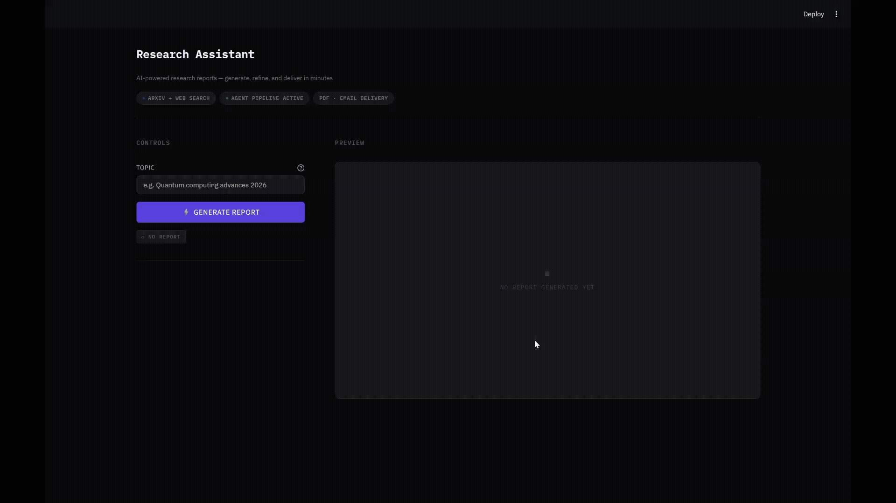

# 🧠 AgentResearch Synthesizer
> Built with the OpenAI Agents SDK (local LLM backend)

An interactive multi-agent research tool that generates structured reports from real-world sources — with live preview, editing, and delivery.

## 🎯 What this does

Turns a research topic into a structured, source-backed report with an interactive workflow: generate → review → refine → export.

---

## 🚀 Features

- **Multi-agent pipeline** — separate Research Agent and Writer Agent with strict role separation
- **Live data sources:**
  - 📄 arXiv (academic papers)
  - 🌐 Web search
- **Structured research reports:**
  - Executive summary
  - Key findings
  - Cited sources
- **Live HTML preview** with styled report rendering
- **Regeneration controls:**
  - Regenerate summary
  - Regenerate key findings
  - Regenerate individual findings
- **Export & delivery:**
  - 📥 PDF download
  - 📧 Email delivery via SMTP
- **Streamlit UI** with responsive layout

---

## 🏗️ Architecture

```
User Input
    ↓
Research Agent
    → arXiv API + Web Search
    ↓
Writer Agent
    → Structured JSON report
    ↓
Formatter → HTML → PDF
    ↓
UI (Preview + Regenerate controls)
    ↓
Email Delivery / PDF Download
```

---

## ⚙️ Setup

### 1. Clone the repo

```bash
git clone <repo-url>
cd <repo-folder>
```

### 2. Install dependencies

```bash
pip install -r requirements.txt
```

### 3. Configure environment

Create a `.env` file in the root directory:

```env
EMAIL_USER=your_email@gmail.com
EMAIL_PASS=your_app_password
```

> **Note:** For Gmail, use an [App Password](https://support.google.com/accounts/answer/185833), not your regular password.

### 4. Run the app

```bash
streamlit run app.py
```

---

## 📌 Key Design Decisions

| Decision | Rationale |
|---|---|
| Strict agent role separation | Keeps research and writing concerns isolated; easier to swap models or sources |
| Robust JSON parsing | LLMs can produce inconsistent output; defensive parsing prevents silent failures |
| Human-in-the-loop workflow | Users preview and regenerate before any delivery action |
| OpenAI-compatible API | Supports local LLMs via Ollama or any OpenAI-compatible endpoint |

---

## 🧩 Tech Stack

| Layer | Technology |
|---|---|
| UI | Streamlit |
| Agent framework | OpenAI Agents SDK |
| PDF generation | WeasyPrint |
| Email delivery | SMTP (smtplib) |
| Data sources | arXiv API, Web search |
| Language | Python 3.10+ |

---

## 🧪 Testing

Run basic component tests:

```bash
python tests.py
```

---

## 🖥️ Demo



---

## 📄 License

MIT
